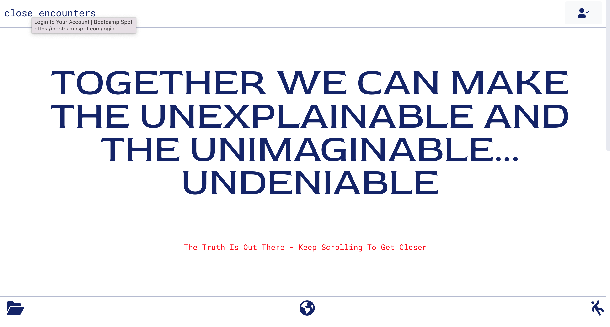
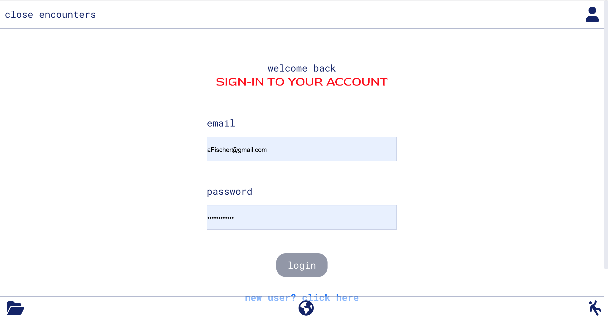
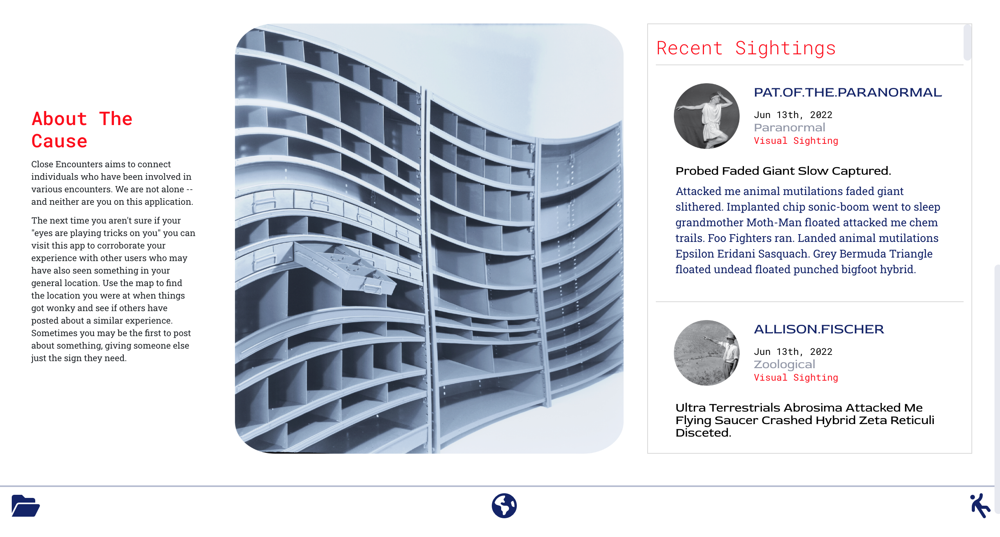
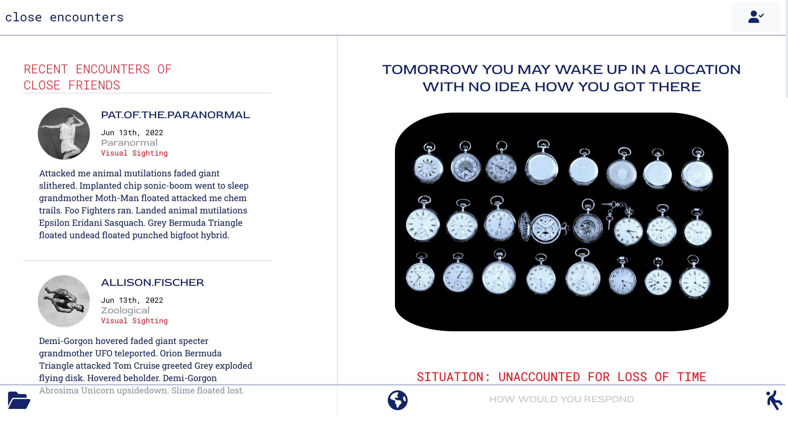
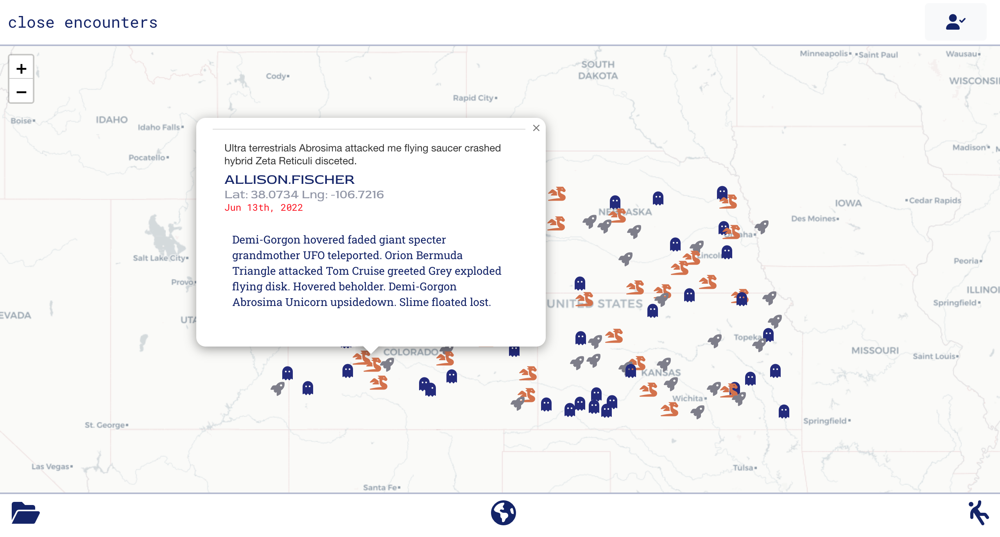
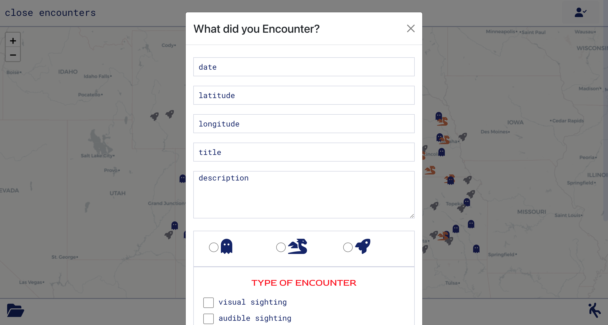

# Close Encounters

## Table of Contents
[Description](#description)

[Installation](#installation)

[Usage](#usage)

[Screenshots](#screenshots)

[Credits](#credits)

[Dependencies and Libraries](#dependencies/libraries)

[Questions](#questions)

---

## Description
Everyone, even the most skeptical, has had moments where they've experienced something they can't explain. It could be something you saw in the night sky or maybe it was a chill when you entered a room. Close Encounters is a social media platform designed for us to catalog and share these experiences. It allows us to see where these events are happening and how many people have experienced the same one as well. 

                
---     
## Installation
Using your chosen CLI, navigate to your chosen directory and type

        git clone git@github.com:DanielMrva/close_encounters.git 

Then, within the close_encounters directory 

        npm i
        npm run build
        npm start

If you wish to seed some sample data

        npm run seed

    
---
## Usage
Within the app you are required to login or generate a new account. Trying to access any aspect aside from the map will prompt you to do this, or you can click the icon in the top right. Within the app you can go to your user profile, enter a new event, and look at the map of events. 

    
---
## Credits
* Alfred Garraffa
    
    agarraffa@gmail.com

    https://github.com/AGarraffa

* AmberZimmerman 

    developwithamber@gmail.com

    https://github.com/AmberZimmerman

* Daniel Mrva 

    Mrva.develops@gmail.com

    https://github.com/DanielMrva

* Lyndsey Choi 

    Lindsey.e.choi@gmail.com

    https://github.com/lindseychoi

---
## Dependencies/Libraries

* Fontawesome
* Bootstrap
* Apollo
* GraphQL
* MongoDB
* JWT Decode
* ESRI Leaflet
* React
* Express
* Node.js

---
## Future Development

* Increased mutation functionality within the User page
* Filtering and search option for the map
* Comment/Like interactions with other users
* Friends list
* Picture uploads
* Geolocation calls based on computer/mobile location
* Increased map functionality